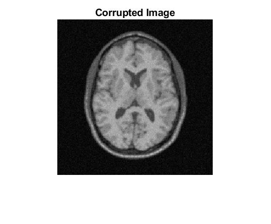
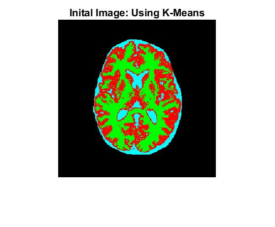
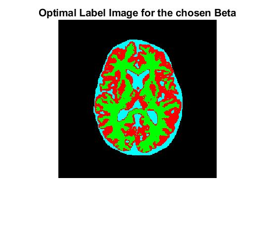

<h1 align="center">HMRF-GMM-EM Segmentation</h1>
    

  </img>
  </img>
  </img>

Image segmentation using the Expectation-Maximization (EM) algorithm that relies on a Gaussian Mixture Model (GMM) for the intensities 
and a Markov Random Field (MRF) model on the labels.   
This is based on [*"Segmentation of brain MR images through a hidden Markov random field model and the expectation-maximization algorithm"* (Zhang, Y et al., 2001)](https://ieeexplore.ieee.org/document/906424)
       
## Usage:
See [`code/main.mlx`](code/main.mlx) and run it cell by cell.

## Documentation:
- [`code/main.mlx`](code/main.mlx): The main script/driver program
- [`code/EM.m`](code/EM.m): Implements the EM algorithm
- [`code/G.m`](code/G.m): Returns the Gaussian PDF's value at the given point
- [`code/ICM.m`](code/ICM.m): Finds the optimal labelling using a modified Iterated Conditional Modes (ICM) algorithm
- [`code/KMeans.m`](code/KMeans.m): Returns the initial segmentation using the standard K-means algorithm
- [`code/logPosterior.m`](code/logPosterior.m): Computes the log of the posterior probability for the labels (up to a constant)
- [`code/priorPenalty.m`](code/priorPenalty.m): The prior penalty for the given pixel using a 4 neighbourhood system, without wrap-around (uses the Potts Model)
- [`code/showSegmented.m`](code/showSegmented.m): Plots the segmented image using a custom colormap

---

*(This was done as a course assignment for CS736: Medical Image Computing, Spring 2021, IIT Bombay)*
